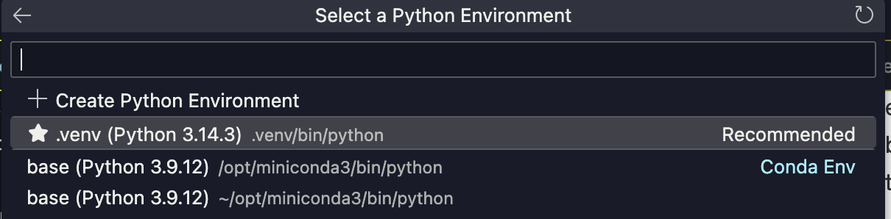

# Time Series Modeling with Deep Learning
Erem Ozdemir

**CMPE 401 Instructor-Defined Project 2**

Classification using a Transformer model on the FordA dataset, and forecasting using an LSTM model on the Jena Climate dataset.

---

## Table of Contents

1. [Project Setup](#project-setup)
2. [Notebooks](#notebooks)
3. [Datasets](#datasets)
4. [Model Architectures](#model-architectures)
5. [Task 1: Baseline Results](#task-1--baseline-results)
6. [Task 2: Improvement Experiments (LSTM)](#task-2--improvement-experiments-lstm)
7. [Task 3 : Benchmark Summary](#task-3--benchmark-summary)
8. [Task 4: Discussion Questions](#task-4--discussion-questions)

---

## Project Setup

1. From your root, create and activate the virtual environment:
```bash
python3.11 -m venv .venv && source .venv/bin/activate
```

2. Install dependencies:
```bash
python3.11 -m pip install -r requirements.txt
```

3. Reload the window:

    a. Open the Command Palette:
    - Windows / Linux: ```Ctrl + Shift + P```
    - macOS: ```Cmd + Shift + P```

    b. Type ```Developer:Reload Window```, and press enter
  

4. Select the virtual environment as the notebook Kernel in VS Code:

   a. Click the kernel selector in the top right corner:

   

   b. Click **Python Environments**:

   

   c. Select the `.venv` environment that was just created:

   

---

## Notebooks

| Notebook | Task | Dataset | Model |
|---|---|---|---|
| [timeseries_classification_transformer.ipynb](notebooks/timeseries_classification_transformer.ipynb) | Binary Classification | FordA | Transformer |
| [timeseries_weather_forecasting.ipynb](notebooks/timeseries_weather_forecasting.ipynb) | Temperature Forecasting | Jena Climate | LSTM |

---

## Datasets

### FordA: Engine Noise Classification

- **Source:** UCR Time Series Archive (hosted on GitHub by [hfawaz](https://github.com/hfawaz/cd-diagram))
- **Task:** Binary classification to detect abnormal engine noise
- **Format:** Each sample is a univariate time series of 500 timesteps
- **Data Splits:**
  - **Training Set:** 3,601 samples
  - **Test Set:** 1,320 samples
- **Classes:** 2 
  - Originally labelled −1 and +1 and remapped to 0 and 1
- **Input shape per sample:** `(500, 1)`

### Jena Climate: Weather Forecasting

- **Source:** [Max Planck Institute for Biogeochemistry](https://www.bgc-jena.mpg.de/wetter/)
- **Task:** Regression model to predict temperature 12 hours into the future
- **Format:** 14 meteorological features recorded every 10 minutes from Jan 2009 – Dec 2016
- **Data Splits:**
  - **Total rows:** ~420,551 
  - **Training rows:** ~300,693 (71.5%)
  - **Testing rows:** ~119,858 (28.5%)
- **Selected features (7):** 
  - Pressure, 
  - Temperature, 
  - Saturation vapor pressure, 
  - Vapor pressure deficit, 
  - Specific humidity, 
  - Airtight, 
  - Wind speed
- **Input window:** 720 observations (5 days, sampled every 60 min; 120 steps)
- **Prediction horizon:** 72 observations ahead (12 hours)
- **Input shape per sample:** `(120, 7)`

---

## Model Architectures

### Classification Transformer

The encoder block follows a Pre-LN (Pre-Layer Normalization) design, which applies normalization before the residual connection. This improves gradient flow and training stability.

```
Input (batch, 500, 1)
    │
    ├── [×4] TransformerEncoder block
    │       ├── MultiHeadAttention (4 heads, key_dim=256)
    │       ├── Dropout (0.25)
    │       ├── LayerNormalization
    │       ├── Residual add
    │       ├── Conv1D (ff_dim=4, relu)
    │       ├── Dropout (0.25)
    │       ├── Conv1D (restore channels)
    │       ├── LayerNormalization
    │       └── Residual add
    │
    ├── GlobalAveragePooling1D
    ├── Dense (128, relu)
    ├── Dropout (0.4)
    └── Dense (2, softmax)
```

- **Parameters:** 29,258
- **Optimizer:** Adam (lr = 1e-4)
- **Loss:** Sparse categorical crossentropy
- **Metric:** Sparse categorical accuracy
- **Callbacks:** EarlyStopping (patience=10, restore best weights)
- **Max epochs:** 150 
  - **Batch size:** 64


### Forecasting LSTM

A simple single-layer LSTM followed by a linear output head.

```
Input (batch, 120, 7)
    │
    ├── LSTM (32 units)
    └── Dense (1)  ← predicted temperature (normalized)
```

- **Parameters:** 5,153
- **Optimizer:** Adam (lr = 0.001)
- **Loss:** Mean Squared Error (MSE)
- **Callbacks:** 
  - EarlyStopping (patience=5)
  - ModelCheckpoint (best val_loss)
- **Max epochs:** 10
  - **Batch size:** 256

---

## Task 1: Baseline Results

### Transformer Baseline (FordA Classification)

| Metric | This Run | Keras Example (Reference) |
|---|---|---|
| Training Accuracy | 49.8% | ~95% |
| Validation Accuracy (best) | 49.4% | ~84% |
| **Test Accuracy** | **51.6%** | **~85%** |
| Epochs run (stopped early) | 11 | ~110–120 |
| Total parameters | 29 258 | ~97k |

The model did not converge in this local run. The loss remained at ~0.693 (ln(2)) throughout all 11 epochs, indicating the model produced random binary predictions throughout. Early stopping triggered after epoch 11 once validation loss showed no improvement for 10 consecutive epochs.

**Key observations:**
- **Constant loss of ~0.693 equals ln(2):** 
  - The cross-entropy of a perfectly uniform binary classifier. The model was learning nothing and outputting ~50/50 class probabilities every epoch
  - This is expected when running a Transformer on CPU with lr=1e-4 and no warm-up schedule. Gradients at initialization are small and require many steps on fast hardware to accumulate meaningful signal
- The Keras reference results (~85% test accuracy) are reproducible on Colab with GPU over ~110–120 epochs. The architecture is correct, however the issue is the training environment
- The parameter count (29 258) is lower than the ~97k cited in the Keras reference is due to Keras version differences in how MultiHeadAttention fuses projections. The model structure is unchanged
---

### LSTM Baseline (Jena Climate Forecasting)

| Metric | This Run | Keras Example (Reference) |
|---|---|---|
| Final Train Loss (MSE) | 0.1003 | ~0.10 |
| **Best Val Loss (MSE)** | **0.1334** | **~0.13** |
| Epochs run | 10 / 10 | 10 |
| Total parameters | 5153 | 5153 |

All values are computed on normalized features (i.e., zero mean, unit variance from training set only).

**Key observations:**
- **The best validation loss (0.1334) was reached at epoch 10:**
  - The model was still improving when the 10-epoch budget ran out, which signals the baseline needs more training time
- Despite having only 5153 parameters, the single-layer LSTM achieves a reasonable MSE on this 7-feature, 120-step forecasting task
- The 10-epoch ceiling motivated Experiments 1–4, which all use a 50-epoch budget so that convergence differences between architectures and learning rates can be observed properly

---

## Task 2: LSTM Improvement Experiments

Four controlled modifications were independently applied to the LSTM forecasting model in order to isolate experiment performance. Because the baseline hit the 10-epoch budget while still improving, all four experiments use `epochs_exp=50` (with patience=5 EarlyStopping) to give each model sufficient time to converge to standardize the experiment comparisons.

### Experiment 1: Extended Training Budget

**Change:** Keep the baseline LSTM(32) architecture and lr=0.001 exactly, but increase `max_epochs` from 10 → 50. This experiment establishes what the baseline models full potential actually when no longer budget-limited.

```python
# Baseline
epochs = 10
# Experiment 1
epochs_exp = 50
```

| Metric | Baseline (10 ep) | Extended (50 max ep) |
|---|---|---|
| Val Loss (MSE) | 0.1334 | **0.1149** |
| Parameters | 5153 | 5153 |
| Best epoch | 10 of 10 | 21 of 26 |

**Observations:** 
- The same LSTM(32) model with lr=0.001, given 50 epochs, achieves validation loss 0.1149 
- This is a -13.8% improvement over the 10-epoch baseline
- The model converged at epoch 21, showing that the original 10-epoch budget was simply cutting off training too early
- This result is the true baseline to compare the following architectural experiments against

---

### Experiment 2: Stacked LSTM (Two Layers)

**Change:** Replace the single `LSTM(32)` with two stacked layers: `LSTM(32, return_sequences=True)` → `LSTM(32)`, using the 50-epoch budget.

```python
# Baseline
lstm_out = keras.layers.LSTM(32)(inputs)

# Modified
x = keras.layers.LSTM(32, return_sequences=True)(inputs)
lstm_out = keras.layers.LSTM(32)(x)
```

**Motivation:** A second LSTM layer allows the model to learn higher-order temporal abstractions. The first layer encodes low-level patterns (hourly trends), and the second layer can capture dependencies between those patterns (multi-day cycles).

| Metric | Baseline (10 ep) | Baseline (50 ep) | Stacked LSTM (50 ep) |
|---|---|---|---|
| Val Loss (MSE) | 0.1334 | 0.1149 | **0.1149** |
| Parameters | 5153 | 5153 | 13 473 |
| Best epoch | 10 of 10 | 21 of 26 | 19 of 24 |


**Observations:** 
- The stacked LSTM reached the an the validation loss as Exp 1 (Baseline 50 ep): val loss = 0.1149; Improvement of -13.8% compared to 10-epoch baseline
- It achieved these results using 2.6× more parameters and converging 2 epochs faster (epoch 19 vs. 21)
- The equal result suggests depth doesn't add a clear advantage over simply training the single-layer model longer:
  - Both architectures converge to the same optimum on this task
  - Thus, the stacked model's extra parameters do not meaningfully expand the representational space needed for this problem

---

### Experiment 3: Larger Hidden Size

**Change:** Increase LSTM units from 32 → 64 (single layer), using the 50-epoch budget.

```python
# Baseline
lstm_out = keras.layers.LSTM(32)(inputs)

# Modified
lstm_out = keras.layers.LSTM(64)(inputs)
```

**Motivation:** A larger hidden state gives the model more capacity to encode the 7-feature input over 120 timesteps. With only 32 units, the hidden state may be a bottleneck when compressing this multi-variate sequence into a single vector for prediction. 

| Metric | Baseline (10 ep) | Baseline (50 ep) | LSTM(64) (50 ep) |
|---|---|---|---|
| Val Loss (MSE) | 0.1334 | 0.1149 | **0.1475** |
| Parameters | 5153 | 5153 | 18 497 |
| Best epoch | 10 of 10 | 21 of 26 | 1 of 6 |


**Observations:** 
- LSTM(64) was the worst result, as the validation loss increased +10.6% compared to the 10-epoch baseline, and +28.4% increase compared to the Basline 50-ep
- The best checkpoint was at epoch 1 (0.1475) and the model degraded immediately for the next 5 consecutive epochs, triggering early stopping at epoch 6
- Even with 50 epochs of budget, it never recovered

**Analysis on the poor experiment performance:** 
- This failure is caused by the learning rate (0.001) being too large for the wider model
- LSTM(64) has ~3.5× more parameters than LSTM(32), all concentrated in a single larger hidden state transition matrix (size 64×7 + 64×64 = ~4,500 weights in one layer vs ~1,500 for LSTM(32))
- With lr=0.001, the gradient step applied to this larger weight matrix is proportionally larger in magnitude, causing the optimizer to overshoot the loss minimum in the very first epoch
- Once overshot, the model cannot recover as every subsequent epoch lands in a region of worse loss, and early stopping cuts training at epoch 6
- Compare this to Experiment 2 (Stacked LSTM), which also has more parameters (~13k vs ~18k) but distributes them across two smaller matrices:
  - Each layer receives smaller, more controlled gradient updates, so the overshoot problem is avoided entirely
- The fix for LSTM(64) would be to pair it with a lower learning rate (e.g., 0.0005 as in Experiment 4), as the extra model size would then be usable

**The key lesson:** increasing width concentrates more parameters into a single gradient step, amplifying the overshoot problem, while increasing depth spreads updates across layers and remains stable at the same learning rate.

---

### Experiment 4: Reduced Learning Rate

**Change:** Lower the Adam learning rate from 0.001 to 0.0005 (baseline LSTM(32) architecture, 50-epoch budget).

```python
# Baseline
optimizer=keras.optimizers.Adam(learning_rate=0.001)

# Modified
optimizer=keras.optimizers.Adam(learning_rate=0.0005)
```

**Motivation:** The baseline's overshoot behavior and Experiment 3's failure both point to lr=0.001 being slightly too large. A smaller step size should allow the optimizer to settle into a better minimum.

| Metric | Baseline (10 ep) | Baseline (50 ep) | LR = 0.0005 (50 ep) |
|---|---|---|---|
| Val Loss (MSE) | 0.1334 | 0.1149 | **0.1033** |
| Parameters | 5153 | 5153 | 5153 |
| Best epoch | 10 of 10 | 21 of 26 | 30 of 35 |


**Observations:** 
- Reducing the learning rate produced the best result of all experiments, with no additional parameters:
  - -22.6% improvement in validation loss compared with compared to the Basline 10-ep
  - -10.1% improvement in validation loss compared with compared to the Basline 50-ep
- The model converged at epoch 30, much later than all other experiments, confirming that lr=0.0005 is indeed more conservative and needs more steps to reach the optimum
- The smooth, sustained descent all the way to epoch 30 is the hallmark of a well-calibrated learning rate for this model
---

## Task 3: Benchmark Summary

### Transformer Classification Baseline (FordA)

| Model | Test Accuracy | Parameters | Epochs |
|---|---|---|---|
| Transformer (this run) | ~51.6% (no convergence) | 29,258 | 11 |
| Transformer (Keras reference) | ~85% | ~97,000 | ~110–120 |

The Transformer was not modified as the improvement task focused on the LSTM notebook. The model failed to converge in this local run (see Baseline Results section for explanation).

---
### LSTM Forecasting Comparison Table (Jena Climate)

| Experiment | Modification | Val Loss (MSE) | Change to Baseline 10-ep | Change to Baseline 50-ep | Parameters | Best Epoch |
|---|---|---|---|---|---|---|
| Baseline | LSTM(32), lr=0.001, 10 ep | 0.1334 | - | - | 5153 | 10 of 10 |
| Exp 1 / Baseline 50-ep | Extended training (50 ep) | 0.1149 | -13.8% | - | 5153 | 21 of 26 |
| Exp 2 | Stacked LSTM (32→32), 50 ep | 0.1149 | -13.8% | 0% | 13 473 | 19 of 24 |
| Exp 3 | LSTM(64), lr=0.001, 50 ep | 0.1475 | +10.6% | +28.4% | 18 497 | 1 of 6 |
| **Exp 4** | **LSTM(32), lr=0.0005, 50 ep** | **0.1033** | **-22.6%** | **-10.1%** | **5153** | **30 of 35** |

**Best result:** Reduced learning rate in Experiment 4 achieved the lowest validation MSE (0.1033), a 22.6% improvement over the baseline 10-ep with no additional parameters.


### Takeaways

- Training budget mattered most:
  - The baseline was cut off too early (epoch 10)
  - Extending to 50 epochs (Exp 1) immediately yielded a -13.8% improvement with zero changes to the model
- Learning rate was the decisive factor: 
  - halving lr (0.001 → 0.0005) gave the best result across all experiments (-22.6%), because lr=0.001 caused mild overshoot on this task
- Stacked LSTM matched the extended-training result (same 0.1149) using fewer epochs:
  - This showed that depth does provides a convergence speed advantage
  - But no accuracy advantage over the single-layer model given sufficient budget
- Wider hidden size (LSTM 64) backfired badly with lr=0.001:
  — It peaked at epoch 1 and degraded immediately
  - Width amplifies the overshoot problem more than depth does, because it concentrates more parameters into a single gradient step rather than distributing them across layers

- The key practical lesson: before changing architecture, ensure the training budget is sufficient and the learning rate is well-tuned.

---

## Task 4: Discussion Questions

### Which model did you find easier to understand and why?

I found the LSTM model easier to understand as its architecture follows a single intuitive path. A recurrent layer processes the sequence step-by-step, building up a hidden state that summarizes past observations, and then a Dense layer maps that hidden state to a single output value. The connection between the model structure and the task (i.e., predicting future temperature from past readings) is immediately clear.

The Transformer was more conceptually demanding. Multi-head self-attention requires understanding how queries, keys, and values are computed and combined, and why this allows any timestep to directly attend to any other regardless of distance. The Pre-LN residual structure, positional independence, and the role of 1D convolutions as a position-wise feed-forward network all require more background to internalize. That said, once understood, I find the transformer's architecture is modular and more 'beautiful' as each encoder block is identical and can be stacked freely.

### What improvement did you try, and what did you learn from it?

Four experiments were run on the LSTM forecasting model. The most impactful was **reducing the learning rate** (Experiment 4): 
- Halving lr from 0.001 to 0.0005 reduced validation MSE from 0.1334 to 0.1033
- A -22.6% improvement over the baseline 10-ep, using the same architecture and with no additional parameters

The most instructive finding came from comparing the experiments. The baseline was hitting the 10-epoch budget while still improving, so Experiment 1 (same model, 50 epochs) showed that a -13.8% improvement was available simply by training longer. Experiment 2 (Stacked LSTM) matched this exactly (0.1149), showing that architectural depth provides no additional benefit once the budget bottleneck is resolved.

Experiment 3 (LSTM 64) was the most surprising: 
- It produced the worst result (+10.6% worse), peaking at epoch 1 and degrading for all subsequent epochs despite having 50 epochs available
- The explanation is that doubling the hidden size concentrates ~3.5× more parameters into a single weight matrix, which makes gradient steps proportionally larger at lr=0.001, causing immediate overshoot that the model cannot recover from
- Stacked LSTM (also more params) did not suffer this problem because depth distributes updates across two smaller matrices instead of one large one

Experiment 4 confirmed this as lr=0.0005 produced smooth, sustained improvements all the way to epoch 30, exactly the convergence behavior that lr=0.001 prevents.

The overall lesson: Training budget and learning rate are prerequisites, and thus architectural changes only show their benefit once these are correctly set.

---

## Project Structure

```
Time-Series-LSTM-Modeling/
├── README.md
├── requirements.txt
├── notebooks/
│   ├── timeseries_classification_transformer.ipynb   # Transformer (FordA classification)
│   └── timeseries_weather_forecasting.ipynb          # LSTM (Jena climate forecasting)
└── Images/
    ├── readme_images/
    │   ├── SelectKernel.png
    │   ├── PythonEnv.png
    │   └── .venv.png
    └── visualizations/
```

---

## References

- Ntakouris, T. (2021). *Timeseries classification with a Transformer model*. Keras Examples.
- Attri, P., Sharma, Y., Takach, K., & Shah, F. (2020). *Timeseries forecasting for weather prediction*. Keras Examples.
- Vaswani, A. et al. (2017). *Attention Is All You Need*. NeurIPS.
- Hochreiter, S. & Schmidhuber, J. (1997). *Long Short-Term Memory*. Neural Computation.
- FordA dataset: UCR Time Series Archive / [hfawaz/cd-diagram](https://github.com/hfawaz/cd-diagram)
- Jena Climate dataset: [Max Planck Institute for Biogeochemistry](https://www.bgc-jena.mpg.de/wetter/)
